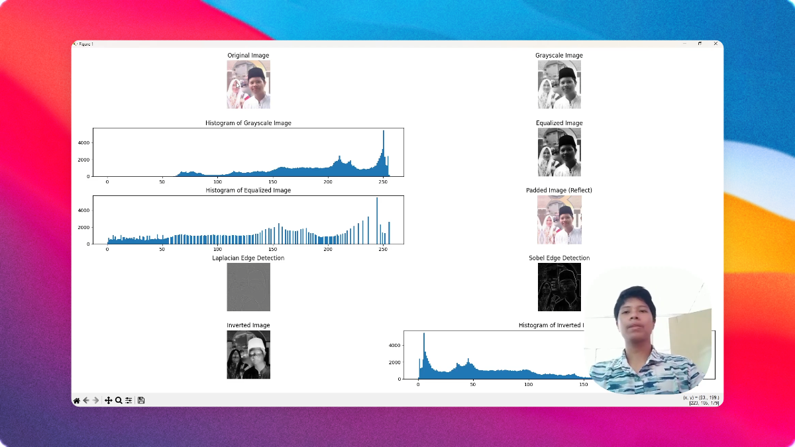

# Kernel Image Processing

A Python-based image processing project demonstrating various computer vision techniques using OpenCV and custom kernel convolutions.



## Overview

This project showcases fundamental image processing operations including grayscale conversion, histogram equalization, edge detection, padding, and image transformations. The project demonstrates both built-in OpenCV functions and custom kernel-based filtering techniques.

## Features

- **RGB to Grayscale Conversion**: Convert color images to grayscale for simplified processing
- **Histogram Equalization**: Enhance image contrast by redistributing pixel intensity values
- **Histogram Analysis**: Visualize pixel intensity distributions before and after transformations
- **Border Padding**: Apply reflect-type padding to image borders
- **Edge Detection**:
  - Laplacian kernel for detecting edges in all directions
  - Sobel kernel for directional edge detection
- **Image Inversion**: Negative transformation (255 - pixel value)
- **Comprehensive Visualization**: Display results in organized grid layouts with matplotlib

## Technologies Used

- **Python 3.x**
- **OpenCV (cv2)**: Image processing and computer vision operations
- **NumPy**: Numerical operations and array manipulation
- **Matplotlib**: Data visualization and result plotting

## Installation

1. Clone this repository:

```bash
git clone https://github.com/killflex/kernel-img-processing.git
cd kernel-img-processing
```

2. Install required dependencies:

```bash
pip install opencv-python numpy matplotlib
```

## Usage

### Basic Usage

Run any of the main scripts:

```bash
python nomain.py
```

or

```bash
python main.py
```

or

```bash
python index.py
```

### Input Image

Place your image file in the project directory and name it `ferry.jpg`, or modify the image path in the script:

```python
img_rgb = cv.imread('your_image.jpg')
```

## Code Structure

### Files

- **`nomain.py`**: Main implementation with comprehensive 3x3 grid visualization

  - Shows RGB, grayscale, padded, and equalized images
  - Displays edge detection results with two different kernels
  - Includes histograms for analysis

- **`main.py`**: 2x3 grid layout with Laplacian and Sobel edge detection

  - Simplified visualization with essential transformations
  - Histogram comparison between grayscale and edge-detected images

- **`index.py`**: Extended 5x2 grid layout with additional transformations

  - Includes image inversion (negative transformation)
  - Comprehensive visualization of all processing steps

- **`gemini.py`**: Streamlined implementation with histogram equalization and edge detection

## Image Processing Techniques

### 1. Grayscale Conversion

Converts RGB image to single-channel grayscale:

```python
img_gray = cv.cvtColor(img_rgb, cv.COLOR_BGR2GRAY)
```

### 2. Histogram Equalization

Improves image contrast by spreading out pixel intensity values:

```python
equalized_img = cv.equalizeHist(img_gray)
```

### 3. Border Padding (Reflect)

Adds padding to image borders using reflection:

```python
padded_img = cv.copyMakeBorder(img_gray, 44, 44, 39, 39, cv.BORDER_REFLECT)
```

### 4. Edge Detection

#### Laplacian Kernel

Detects edges in all directions:

```python
kernel1 = np.array([[-1, -1, -1],
                    [-1,  8, -1],
                    [-1, -1, -1]])
edge1 = cv.filter2D(equalized_img, -1, kernel1)
```

#### Sobel Kernel

Detects edges in specific directions:

```python
kernel2 = np.array([[1, 0, -1],
                    [1, 0, -1],
                    [1, 0, -1]])
edge2 = cv.filter2D(equalized_img, -1, kernel2)
```

### 5. Image Inversion

Creates negative of the image:

```python
image_inverted = 255 - image_gray
```

## Example Results

The output displays:

- Original RGB image
- Grayscale conversion
- Padded image with border reflection
- Histogram-equalized image
- Edge detection using Laplacian kernel
- Edge detection using Sobel kernel
- Histogram visualizations for intensity distribution analysis

## Project Structure

```
kernel-img-processing/
│
├── ferry.jpg           # Input image
├── result.png          # Output visualization
├── nomain.py          # Main script (3x3 grid)
├── main.py            # Simplified script (2x3 grid)
├── index.py           # Extended script (5x2 grid)
├── gemini.py          # Streamlined implementation
└── README.md          # Project documentation
```
